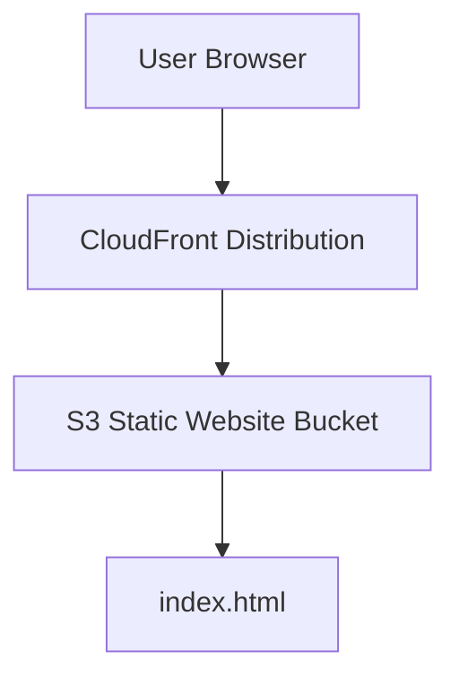

# Design Document

## Overview

The static calculator site will start with a simple landing page (index.html) that introduces the rowing training zone calculator tool. The landing page will have a clean, Material Design-inspired interface that welcomes users and provides an overview of the calculator functionality. The site will be hosted on AWS S3 with CloudFront distribution for global content delivery.

## Architecture

### High-Level Architecture



### Infrastructure Components

- **S3 Bucket**: Hosts static website files with public read access
- **CloudFront Distribution**: CDN for global content delivery and HTTPS termination
- **AWS CDK**: Infrastructure as Code for consistent deployment

### Frontend Architecture

- **Static Landing Page**: Simple HTML page with embedded CSS
- **Material Design CSS**: Custom CSS following Material Design principles
- **No JavaScript**: Landing page focuses on presentation and navigation

## Components and Interfaces

### Landing Page Components

#### 1. Header Section

- **Purpose**: Welcome users and introduce the calculator tool
- **Elements**:
  - Site title/logo
  - Brief description of the rowing zone calculator
  - Hero section with Material Design styling

#### 2. Feature Overview

- **Purpose**: Explain what the calculator does
- **Elements**:
  - Feature cards highlighting key capabilities
  - Icons representing different input methods (2000m time, heart rate)
  - Benefits of using zone-based training

#### 3. Navigation Section

- **Purpose**: Guide users to the calculator functionality
- **Elements**:
  - Call-to-action button to access calculator
  - Material Design button styling
  - Clear visual hierarchy

## Page Structure

### HTML Structure

```html
<!DOCTYPE html>
<html>
<head>
  <title>Rowing Zone Calculator</title>
  <meta name="viewport" content="width=device-width, initial-scale=1.0">
  <link href="https://fonts.googleapis.com/css2?family=Roboto:wght@300;400;500&display=swap" rel="stylesheet">
  <style>/* Material Design CSS */</style>
</head>
<body>
  <header><!-- Site header --></header>
  <main>
    <section class="hero"><!-- Welcome section --></section>
    <section class="features"><!-- Feature overview --></section>
    <section class="cta"><!-- Call to action --></section>
  </main>
  <footer><!-- Simple footer --></footer>
</body>
</html>
```

## Material Design Implementation

### Color Scheme

- **Primary**: Blue (#1976D2)
- **Secondary**: Light Blue (#03DAC6)
- **Surface**: White (#FFFFFF)
- **Background**: Light Grey (#F5F5F5)

### Typography

- **Headers**: Roboto, 32px/24px, Medium weight
- **Body**: Roboto, 16px, Regular weight
- **Captions**: Roboto, 14px, Regular weight

### Components

- **Cards**: Elevated surfaces with subtle shadows (elevation 2)
- **Buttons**: Raised buttons with ripple effects
- **Hero Section**: Large typography with centered layout
- **Feature Cards**: Grid layout with consistent spacing

### Responsive Design

- **Mobile First**: Design for mobile, enhance for desktop
- **Breakpoints**:
  - Mobile: < 600px
  - Tablet: 600px - 1024px
  - Desktop: > 1024px
- **Grid System**: CSS Grid for layout structure

## Testing Strategy

### Manual Testing

- **User Experience**: Validate Material Design implementation
- **Accessibility**: Ensure keyboard navigation and screen reader support
- **Responsive Design**: Test on various screen sizes
- **Cross-browser**: Verify appearance across major browsers
